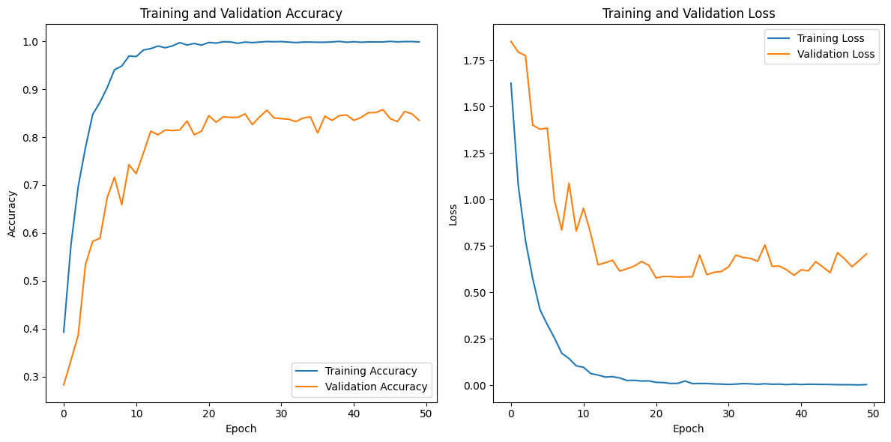
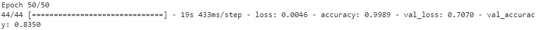

# OptiCool-MachineLearning
## 👓 OptiCool 😎 - Stay in Style, See with Confidence (Team CH2-PS291) - ML Repository

Opticool Machine Learning Repository for Bangkit Capstone Project. Building face shape classifier Model.
## 🤓 The Coolers of Machine Learning Bangkit Academy Capstone Team CH2-PS291
|            Member           | Student ID |        Path        |                    Role                    |                                                       Contacts                                                      |
| :-------------------------: | :--------: | :----------------: | :----------------------------------------: | :-----------------------------------------------------------------------------------------------------------------: |
| Rizky Intan Nurlita  | M008BSX1236 |  Machine Learning  |Machine Learning Engineer |[rizkyintan](https://github.com/rizkyintan)|
| Sayyidan Muhamad Ikhsan | M008BSY1064  |  Machine Learning  | Machine Learning Engineer | [sayyidan-i](https://github.com/sayyidan-i) |
| Ahmad Rosikh Al Muttaqy | M312BSY1903  |  Machine Learning  | Machine Learning Engineer | [creamysausage](https://github.com/creamysausage) |

## Tech Stack


## About 
We have model, eyeglassess frame datasets, and recomendation algorithm in this repository
### Face Shape Classifier
- [Face Shape Classifier](https://github.com/Capstone-OptiCool/ML/blob/main/face_shape_classifier_fix.ipynb) 
(image classification) use MobileNet as the base model for transfer learning that is taken from [Keras](https://keras.io/api/applications/mobilenet/). The model also contains an additional layer that received output from the based model. We use datasets [Face Shape Image Dataset](https://drive.google.com/drive/folders/19dP85vtcz_JzkQMs6e9Z01WZzWchGOJo?usp=drive_link) that contains 3,981 face images.

#### Model Training Performance

#### Performance after Fine Tuning


#### Performance Summary
Models | Accuracy | Val Accuracy
------------ | ------------- | -------------
Face Shape Classifier | 99.8 % | 83.5 %

## Scrapping for Eyeglasses frame from Online Marketplace
We have collected a dataset of 160 diverse eyeglasses frames from various online marketplaces using the [web scraping process](code_scrapping.ipynb). 
The dataset, consisting of 160 entries, is intended to facilitate the development of an eyeglasses frame recommendation system based on classified face shapes. The eyeglasses frame dataset is stored in [cleaned_data_final.csv](cleaned_data_final.csv)
### Metadata

- **MarketplaceLink:** Link to the eyeglasses frame product on the online marketplace.

- **Name:** Name or title of the eyeglasses frame.

- **Brand:** Brand of the eyeglasses frame.

- **FaceShape:** Classified face shape for personalized recommendations.

- **Price:** Price of the eyeglasses frame.

- **Gender:** Gender for which the eyeglasses frame is designed (e.g., Men, Women, Unisex).

- **FrameColour:** Color of the eyeglasses frame.

- **FrameShape:** Shape of the eyeglasses frame (e.g., Rectangular, Round, Aviator).

- **FrameStyle:** Style or design category of the eyeglasses frame.

- **FrameMaterial:** Material used to construct the eyeglasses frame.

- **Pic1, Pic2, Pic3:** Images of the eyeglasses frame from different angles.

- **LinkPic1, LinkPic2, LinkPic3:** Links or URLs to the images of the eyeglasses frame.

Each entry in the dataset includes these attributes, providing comprehensive information for eyeglasses frame recommendations based on face shapes.

## Eyeglasses Recommendation Based on Face Shape
The primary purpose of the eyeglasses recommendation module is to enhance the user experience by offering curated suggestions that complement different face shapes.

### Algorithm Recommendation
- The [recommendation algorithm](Eyeglass_Recomendation.ipynb) utilizes a combination of collaborative filtering and content-based filtering techniques to suggest eyeglasses frames. Collaborative filtering leverages user preferences and similarities, while content-based filtering considers the characteristics of eyeglasses frames and their alignment with face shapes. 
- Users can explore recommended frames, view additional details, and provide feedback to further enhance subsequent recommendations.

## Run the ipynb in Google Colab
You don't need to install anything just follow the steps below:
1. Download or clone this repository
2. Open Google Colab
3. Import the .ipynb file
4. Run the code

## Run in Local

1. Download the .ipynb file or clone this repostitory
2. Run this locally using ex: jupyter notebook
3. Install all the dependencies
  ```
  ! pip install -r requirements.txt
  ```
4. Run all the code
